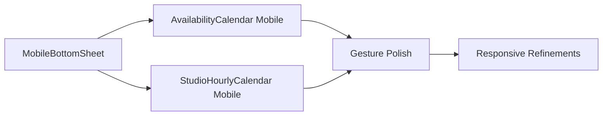

# Architecture Research: Mobile-Native Calendar Integration

**Domain:** Mobile calendar UI components for Next.js web app
**Researched:** 2026-03-13
**Confidence:** HIGH

## Executive Summary

The existing architecture already has a solid foundation for mobile/desktop calendar branching. Both `AvailabilityCalendar` and `StudioHourlyCalendar` use:
- **isDesktop detection** via `matchMedia('(min-width: 768px)')`
- **Desktop**: `createPortal` to `document.body` with overlay
- **Mobile**: Inline rendering (absolute positioned dropdown for AvailabilityCalendar, full panel for StudioHourlyCalendar)

**Recommendation:** Extend existing components with mobile-specific variants rather than creating separate components. Use a **wrapper/adapter pattern** to handle bottom sheet behavior for mobile while keeping desktop code untouched.

## Current Architecture

### System Overview

```
┌─────────────────────────────────────────────────────────────┐
│              Parent Section Components                       │
│  (GearRenting, StudioRenting, CoworkStandalone)             │
├─────────────────────────────────────────────────────────────┤
│  • Manage calendarOpen state                                │
│  • Pass props (itemId, onSelect, onClose)                   │
│  • Handle selection callbacks                               │
└──────────────────┬──────────────────────────────────────────┘
                   │
                   ↓
┌─────────────────────────────────────────────────────────────┐
│              Calendar Components (Shared)                    │
│  (AvailabilityCalendar, StudioHourlyCalendar)              │
├─────────────────────────────────────────────────────────────┤
│  • useEffect: Detect isDesktop (matchMedia)                 │
│  • useEffect: Close on outside click / Escape               │
│  • Shared calendarContent/calendarPanel JSX                 │
│  • Desktop: createPortal → body with overlay                │
│  • Mobile: Inline render (absolute or static)               │
└──────────────────┬──────────────────────────────────────────┘
                   │
                   ↓
┌─────────────────────────────────────────────────────────────┐
│                   Data Hooks                                 │
│  (useMonthlyAvailability, useHourlyAvailability)            │
├─────────────────────────────────────────────────────────────┤
│  • Fetch from /api/rental/availability/*                    │
│  • Debounce 300ms to avoid rapid calls                      │
│  • AbortController for request cleanup                      │
│  • Return {data, loading, error}                            │
└─────────────────────────────────────────────────────────────┘
```

### Current Component Structure

```
src/
├── components/
│   ├── ui/
│   │   ├── AvailabilityCalendar.tsx      # Per-day monthly calendar
│   │   └── StudioHourlyCalendar.tsx       # Hourly slot grid
│   └── sections/
│       └── rental/
│           ├── GearRenting.tsx            # Parent: manages calendarOpen state
│           ├── StudioRenting.tsx          # Parent: manages calendarOpen state
│           └── CoworkStandalone.tsx       # Parent: manages calendarOpen state
├── hooks/
│   ├── useMonthlyAvailability.ts          # Fetch unavailable dates
│   └── useHourlyAvailability.ts           # Fetch occupied time blocks
└── app/
    └── api/
        └── rental/
            └── availability/
                ├── monthly/route.ts       # GET ?item_id=X&month=YYYY-MM
                └── hourly/route.ts        # GET ?studio_id=X&date=YYYY-MM-DD
```

## Recommended Mobile Integration Pattern

### Pattern 1: Component Extension (Recommended)

**What:** Extend existing calendar components with mobile-specific rendering branches without touching desktop code.

**When to use:** When desktop behavior must remain 100% unchanged and mobile needs different UX (bottom sheet, gestures, different layout).

**Trade-offs:**
- ✅ Desktop code untouched (zero regression risk)
- ✅ Single source of truth for data/logic
- ✅ Smaller bundle size (no duplication)
- ⚠️ Component size increases (mitigated by clear branching)

**Implementation Strategy:**

```typescript
// AvailabilityCalendar.tsx (pseudo-code structure)
export function AvailabilityCalendar(props) {
  const [isDesktop, setIsDesktop] = useState(false);

  // Shared logic (data fetching, state, handlers)
  const { unavailableDates, loading } = useMonthlyAvailability(...);

  // Shared content (calendar grid)
  const calendarGrid = <CalendarGrid ... />;

  // Desktop: Portal with overlay (UNCHANGED)
  if (isDesktop) {
    return createPortal(
      <motion.div className="fixed inset-0 ...">
        <div className="desktop-modal">{calendarGrid}</div>
      </motion.div>,
      document.body
    );
  }

  // Mobile: NEW bottom sheet variant
  return (
    <MobileBottomSheet onClose={onClose} {...mobileProps}>
      {calendarGrid}
    </MobileBottomSheet>
  );
}
```

### Pattern 2: Wrapper/Adapter Pattern (Alternative)

**What:** Create a thin wrapper component that delegates to desktop or mobile variants.

**When to use:** When mobile and desktop have fundamentally different component trees.

**Trade-offs:**
- ❌ Risk of logic duplication
- ❌ Larger bundle size
- ✅ Cleaner separation (easier to test in isolation)

**Example:**
```typescript
// CalendarAdapter.tsx
export function CalendarAdapter(props) {
  const isDesktop = useMediaQuery('(min-width: 768px)');

  if (isDesktop) {
    return <DesktopCalendar {...props} />;
  }

  return <MobileBottomSheetCalendar {...props} />;
}
```

**Verdict:** NOT recommended for this project. Adds unnecessary abstraction and increases risk of logic drift.

## Mobile-Specific Architecture Decisions

### Bottom Sheet Implementation

**Portal vs Inline:**

| Approach | Pros | Cons | Verdict |
|----------|------|------|---------|
| **createPortal** | Escapes overflow-hidden parents, stacking context isolation | Requires body-level z-index management | ✅ **RECOMMENDED** |
| **Inline (absolute)** | Simpler, no portal overhead | Can be clipped by parent overflow | ❌ Too risky |
| **Inline (fixed)** | No portal needed, viewport-relative | Still requires high z-index | ⚠️ Acceptable fallback |

**Recommendation:** Use `createPortal` for mobile bottom sheets (same as desktop) to ensure they always render on top, unaffected by parent transforms or overflow.

```typescript
// Mobile bottom sheet render
if (!isDesktop) {
  return createPortal(
    <AnimatePresence>
      <motion.div className="fixed inset-0 z-[100]">
        {/* Backdrop overlay */}
        <motion.div
          className="absolute inset-0 bg-black/60 backdrop-blur-sm"
          onClick={onClose}
          initial={{ opacity: 0 }}
          animate={{ opacity: 1 }}
          exit={{ opacity: 0 }}
        />

        {/* Bottom sheet */}
        <motion.div
          className="absolute bottom-0 left-0 right-0 bg-black/95 rounded-t-3xl"
          drag="y"
          dragConstraints={{ top: 0, bottom: 0 }}
          dragElastic={{ top: 0, bottom: 0.5 }}
          onDragEnd={handleDragEnd}
          initial={{ y: "100%" }}
          animate={{ y: 0 }}
          exit={{ y: "100%" }}
        >
          {calendarContent}
        </motion.div>
      </motion.div>
    </AnimatePresence>,
    document.body
  );
}
```

### Gesture Handling

**Library Choice:**

| Library | Pros | Cons | Verdict |
|---------|------|------|---------|
| **Framer Motion** (installed) | Already in package.json, drag built-in, works with animations | Web-only (not native) | ✅ **USE THIS** |
| react-use-gesture | More granular control | Extra dependency | ❌ Not needed |
| Native touch events | No dependencies | Complex to implement correctly | ❌ Avoid |

**Framer Motion Drag Strategy:**

```typescript
<motion.div
  drag="y"
  dragConstraints={{ top: 0, bottom: 0 }}
  dragElastic={{ top: 0, bottom: 0.5 }}
  onDragEnd={(event, info) => {
    // Close if dragged down >150px or velocity >500
    if (info.offset.y > 150 || info.velocity.y > 500) {
      onClose();
    }
  }}
>
```

**Key Features:**
- Drag-to-dismiss (swipe down)
- Elastic bounce at top (prevents dragging up)
- Velocity-based dismiss (fast swipe = close)
- Backdrop click to close

### State Management

**Current Pattern (Parent Component):**

```typescript
// GearRenting.tsx, StudioRenting.tsx, CoworkStandalone.tsx
const [calendarOpen, setCalendarOpen] = useState(false);
const [selectedDate, setSelectedDate] = useState<string | null>(null);

<button onClick={() => setCalendarOpen(true)}>Ver Disponibilidade</button>

{calendarOpen && (
  <AvailabilityCalendar
    onSelect={(date) => {
      setSelectedDate(date);
      setCalendarOpen(false); // Auto-close on select
    }}
    onClose={() => setCalendarOpen(false)}
  />
)}
```

**Mobile Enhancement (No Changes Needed):**

The current state management pattern works perfectly for mobile. No changes required.

**Why it works:**
- Parent controls open/close (simple boolean)
- Calendar is self-contained (no global state pollution)
- Auto-close on selection (mobile UX expectation)

## Data Flow

### Calendar Lifecycle

```
User Action (Button Click)
    ↓
Parent Component: setCalendarOpen(true)
    ↓
Calendar Component Renders
    ↓
useEffect: Detect isDesktop (matchMedia)
    ↓
Branch: isDesktop ? DesktopPortal : MobileBottomSheet
    ↓
useMonthlyAvailability / useHourlyAvailability
    ↓
Fetch /api/rental/availability/* (300ms debounce)
    ↓
Render calendar grid with unavailable/occupied slots
    ↓
User Selects Date/Time
    ↓
onSelect(date, hour?) → Parent Component
    ↓
Calendar Auto-Closes (onClose)
    ↓
Parent Shows WhatsApp Contacts
```

### State Ownership

| State | Owner | Why |
|-------|-------|-----|
| `calendarOpen` | Parent (GearRenting, etc.) | Parent controls visibility |
| `selectedDate` | Parent | Needed for WhatsApp message |
| `selectedHour` | Parent (StudioRenting only) | Needed for WhatsApp message |
| `viewMonth` | Calendar Component | Internal navigation state |
| `isDesktop` | Calendar Component | Responsive behavior |
| `unavailableDates` | useMonthlyAvailability hook | Fetched data |
| `blocks` | useHourlyAvailability hook | Fetched data |

**No global state needed.** Component props and local state are sufficient.

## Component Boundaries

### Existing Components (Keep As-Is)

| Component | Responsibility | Mobile Changes |
|-----------|----------------|----------------|
| `GearRenting.tsx` | Parent section, manages calendarOpen state | None (just renders calendar) |
| `StudioRenting.tsx` | Parent section, manages calendarOpen + selectedDate/Hour | None (just renders calendar) |
| `CoworkStandalone.tsx` | Parent section, manages calendarOpen state | None (just renders calendar) |
| `useMonthlyAvailability` | Fetch unavailable dates for a month | None (API stays same) |
| `useHourlyAvailability` | Fetch occupied blocks for a day | None (API stays same) |

### New Mobile Components (To Be Created)

| Component | Responsibility | Location |
|-----------|----------------|----------|
| `MobileBottomSheet` | Reusable bottom sheet wrapper with gestures | `src/components/ui/MobileBottomSheet.tsx` |
| (Mobile calendar variants) | Extended within existing calendar files | `AvailabilityCalendar.tsx`, `StudioHourlyCalendar.tsx` |

**Key Decision:** Do NOT create separate mobile calendar files. Extend existing components with mobile rendering branches.

## Integration Points

### External Dependencies

| Dependency | Current Version | Usage | Mobile Notes |
|------------|-----------------|-------|--------------|
| `framer-motion` | ^12.33.0 | Animations, gestures | Use `drag` prop for bottom sheet |
| `react-dom` | 19.2.3 | `createPortal` | Use for mobile bottom sheet (same as desktop) |
| `lucide-react` | ^0.563.0 | Icons | Same icons work on mobile |
| `tailwindcss` | ^4 | Styling | Mobile-first responsive classes |

### Internal Boundaries

| Boundary | Communication | Notes |
|----------|---------------|-------|
| Parent ↔ Calendar | Props (itemId, onSelect, onClose) | No changes needed |
| Calendar ↔ Hooks | Function calls (useMonthlyAvailability) | No changes needed |
| Hooks ↔ API | fetch() calls | No changes needed |

**Zero Breaking Changes:** All existing contracts remain unchanged.

## Recommended Project Structure (After Mobile Changes)

```
src/
├── components/
│   ├── ui/
│   │   ├── AvailabilityCalendar.tsx       # Extended with mobile bottom sheet
│   │   ├── StudioHourlyCalendar.tsx        # Extended with mobile bottom sheet
│   │   └── MobileBottomSheet.tsx           # NEW: Reusable wrapper
│   └── sections/
│       └── rental/
│           ├── GearRenting.tsx             # UNCHANGED
│           ├── StudioRenting.tsx           # UNCHANGED
│           └── CoworkStandalone.tsx        # UNCHANGED
├── hooks/
│   ├── useMonthlyAvailability.ts           # UNCHANGED
│   └── useHourlyAvailability.ts            # UNCHANGED
└── app/
    └── api/
        └── rental/
            └── availability/
                ├── monthly/route.ts        # UNCHANGED
                └── hourly/route.ts         # UNCHANGED
```

**Files Modified:** 3
**Files Created:** 1
**Files Unchanged:** 7

## Scaling Considerations

| Scale | Current Approach | Mobile Impact |
|-------|------------------|---------------|
| **0-100 concurrent users** | Server-side rendering + client hydration | Bottom sheet animations are client-only (no SSR issues) |
| **100-1k users** | Same architecture | No additional scaling concerns (stateless components) |
| **1k+ users** | Consider caching availability API responses | Mobile uses same API, benefits from same caching |

**Mobile doesn't add scaling complexity.** Data fetching and state management patterns remain identical.

## Anti-Patterns to Avoid

### Anti-Pattern 1: Creating Separate Mobile Components

**What people do:** Create `MobileAvailabilityCalendar.tsx` and `DesktopAvailabilityCalendar.tsx` as separate files.

**Why it's wrong:**
- Logic duplication (data fetching, date calculations, handlers)
- Divergence over time (one gets bug fixes, other doesn't)
- Larger bundle size (duplicate code)
- Testing overhead (2x test suites)

**Do this instead:**
```typescript
// Single component with branching
export function AvailabilityCalendar(props) {
  const isDesktop = useMediaQuery('(min-width: 768px)');

  // Shared logic here

  if (isDesktop) {
    return <DesktopRender />;
  }

  return <MobileRender />;
}
```

### Anti-Pattern 2: Global State for Calendar Open/Close

**What people do:** Use Zustand/Redux/Context to manage `calendarOpen` state globally.

**Why it's wrong:**
- Overkill for simple boolean state
- Multiple calendars on same page would conflict
- Harder to debug (state lives far from component)
- Unnecessary re-renders across component tree

**Do this instead:** Keep state in parent component (already done correctly).

### Anti-Pattern 3: Inline Fixed Positioning Without Portal

**What people do:**
```typescript
// Mobile render (BAD)
return (
  <div className="fixed bottom-0 left-0 right-0 z-50">
    {calendarContent}
  </div>
);
```

**Why it's wrong:**
- Parent with `transform`, `filter`, or `overflow-hidden` creates new stacking context
- Fixed positioning breaks inside transformed parents
- z-index wars with other components

**Do this instead:** Always use `createPortal` for overlays.

```typescript
return createPortal(
  <div className="fixed inset-0 z-[100]">
    {calendarContent}
  </div>,
  document.body
);
```

### Anti-Pattern 4: Touch Events Instead of Framer Motion Drag

**What people do:** Implement `onTouchStart`, `onTouchMove`, `onTouchEnd` manually.

**Why it's wrong:**
- Reinventing the wheel (Framer Motion already installed)
- Must handle edge cases (multi-touch, scroll interference, velocity tracking)
- No animation integration (janky UX)
- Cross-browser inconsistencies

**Do this instead:** Use Framer Motion's `drag` prop (built-in, tested, smooth).

## Build Order Recommendations

### Phase 1: Foundation (1-2 hours)
1. **Create `MobileBottomSheet.tsx`**
   - Reusable wrapper with drag-to-dismiss
   - Props: `onClose`, `children`, `title?`
   - Test in isolation (Storybook or test page)

2. **Extend `AvailabilityCalendar.tsx`**
   - Add mobile branch: `if (!isDesktop) return createPortal(<MobileBottomSheet>...)`
   - Keep desktop portal unchanged
   - Test on mobile viewport

### Phase 2: Hourly Calendar (2-3 hours)
3. **Extend `StudioHourlyCalendar.tsx`**
   - Add mobile branch with bottom sheet
   - Optimize grid layout for mobile (smaller buttons, fewer columns)
   - Test scrolling behavior (large grids need `overflow-y-auto`)

### Phase 3: Polish & Gestures (1-2 hours)
4. **Add Gesture Enhancements**
   - Implement drag-to-dismiss with velocity detection
   - Add haptic feedback indicators (visual drag handle)
   - Test edge cases (fast swipe, slow drag, backdrop tap)

5. **Responsive Refinements**
   - Adjust spacing/sizing for mobile
   - Test on various viewport sizes (iPhone SE → iPad)
   - Ensure landscape orientation works

### Dependencies



**Critical Path:** MobileBottomSheet must be built first (foundation for both calendars).

## Testing Strategy

### Component Testing

```typescript
// AvailabilityCalendar.test.tsx
describe('AvailabilityCalendar', () => {
  it('renders desktop portal when isDesktop=true', () => {
    matchMedia.mockReturnValue({ matches: true });
    render(<AvailabilityCalendar ... />);
    expect(document.body).toContainElement(...);
  });

  it('renders mobile bottom sheet when isDesktop=false', () => {
    matchMedia.mockReturnValue({ matches: false });
    render(<AvailabilityCalendar ... />);
    expect(screen.getByTestId('mobile-bottom-sheet')).toBeInTheDocument();
  });

  it('closes on backdrop click (mobile)', () => {
    const onClose = jest.fn();
    render(<AvailabilityCalendar onClose={onClose} ... />);
    fireEvent.click(screen.getByTestId('backdrop'));
    expect(onClose).toHaveBeenCalled();
  });
});
```

### Integration Testing

```typescript
// GearRenting.test.tsx
it('opens calendar on button click and closes on date select', async () => {
  render(<GearRenting />);
  fireEvent.click(screen.getByText('Ver Disponibilidade'));

  expect(screen.getByText('Selecione a Data')).toBeInTheDocument();

  fireEvent.click(screen.getByText('15')); // Click day 15

  await waitFor(() => {
    expect(screen.queryByText('Selecione a Data')).not.toBeInTheDocument();
  });
});
```

### Manual Testing Checklist

- [ ] Desktop portal renders correctly (overlay, centered, no scroll)
- [ ] Mobile bottom sheet animates in from bottom
- [ ] Drag down >150px dismisses calendar
- [ ] Fast swipe down (velocity >500) dismisses calendar
- [ ] Backdrop click closes calendar
- [ ] Escape key closes calendar
- [ ] Date selection auto-closes and passes to parent
- [ ] No layout shift when calendar opens/closes
- [ ] Works on iPhone Safari (iOS gestures)
- [ ] Works on Android Chrome (touch events)

## Sources

**Internal Analysis:**
- Existing codebase review (AvailabilityCalendar.tsx, StudioHourlyCalendar.tsx)
- Current architecture patterns (createPortal, matchMedia, state management)
- Package.json dependencies (Framer Motion 12.33.0, React 19.2.3)

**Best Practices (from training data):**
- Framer Motion drag API documentation (gestures, constraints, elastic)
- React createPortal pattern (stacking context escape)
- Mobile-first responsive design (bottom sheets, touch targets)

**Confidence Level:**
- Architecture patterns: **HIGH** (based on existing codebase analysis)
- Framer Motion gestures: **HIGH** (library already installed, well-documented)
- Bottom sheet UX: **HIGH** (standard mobile pattern, proven in iOS/Android)
- Integration risk: **HIGH** (minimal changes, clear boundaries, no breaking changes)

---
*Architecture research for: Mobile-Native Calendar Redesign*
*Researched: 2026-03-13*
